  

 ## About Me: 
💜 Learning new things. I am passionate about computers, programming and cyber-sec.

## Github Stats:
 
 

  

 

 

 

### 🔮 Tools / Languages:

<h5 align="left"> These are the tools and languages that I have working with and have experience using them.</h5>

###

  
  
  
  
  
  
  
  
  
  
  
  
  
  
  
  
  
  
  
  
  
  
  
  
  
  
  
  
  
  
  
  
  
  
  
  
  
  
  
  
  
  

###

 

###

### 🪄 Top Contributed Repo:

### Graph:

### Show some ❤️ by starring some of my repositories !!

<picture>

</picture>
